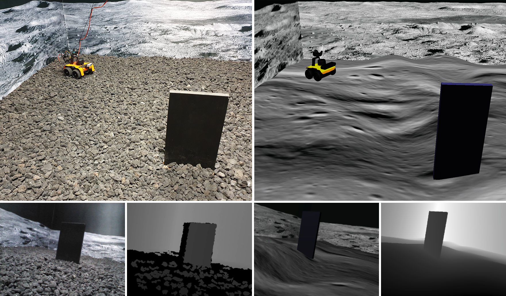
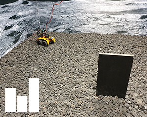
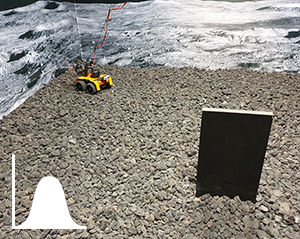
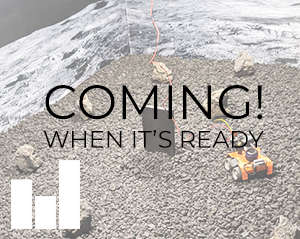
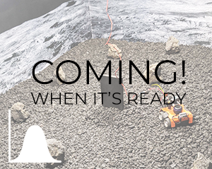

# OffWorld Gym

The challenge that the community sets as a benchmark is usually the challenge that the community eventually solves. The ultimate challenge of reinforcement learning research is to train *real* agents to operate in the *real* environment, but until now there has not been a common real-world RL benchmark.  

OffWorld Gym is **free to use**, try it out at [gym.offworld.ai](https://gym.offworld.ai)

## Real-world Robotics Environment for Reinforcement Learning Research

We have created OffWorld Gym - a collection of real-world environments for reinforcement learning in robotics with free public remote access. Close integration into the existing ecosystem allows you to start using OffWorld Gym without any prior experience in robotics and removes the burden of managing a physical robotics system, abstracting it under a familiar API.

When testing your next RL algorithm on Atari, why not also gauge its applicability to the real world!

Install the library, change your `gym.make('CartPole-v0')` to `gym.make('OffWorldMonolith-v0', ...)` and you are all set to run your RL algorithm on a **real robot**, for free!

  
Environment 1: OffWorld Monolith

## Evironments
| Real | Description |
| --- | --- |
|  `OffWorldMonolithDiscreteReal-v0`  | Wheeled robot on an uneven terrain. Four **discrete actions**: left, right, forward, back. State space is RGB and/or Depth camera image. Sim version is available as `OffWorldMonolithDiscreteSim-v0`. |
|  `OffWorldMonolithContinousReal-v0`  | Wheeled robot on an uneven terrain. Two **continuous actions**: angular velocity, linear velocity. State space is RGB and/or Depth camera image. Sim version is available as `OffWorldMonolithContinousSim-v0`. |
|  `OffWorldMonolithObstacleDiscreteReal-v0`  | Wheeled robot on an uneven terrain with **obstacles**. Four **discrete actions**: left, right, forward, back. State space is RGB and/or Depth camera image. Sim version is available **already now** as `OffWorldMonolithObstacleDiscreteSim-v0`. |
|  `OffWorldMonolithObstacleContinousReal-v0`  | Wheeled robot on an uneven terrain with **obstacles**. Two **continuous actions**: angular velocity, linear velocity. State space is RGB and/or Depth camera image. Sim version is available **already now** as `OffWorldMonolithObstacleContinousSim-v0`. |

## Getting access to OffWorld Gym
The main purpose of OffWorld Gym is to provide you with easy access to a physical robotic environment and allow you to train and test your algorithms on a real robotic system. To get access to the real robot, head to our web portal [gym.offworld.ai](https://gym.offworld.ai) and do the following:

  * Register as a user at [gym.offworld.ai](https://gym.offworld.ai).
  * [Book your experiment](https://gym.offworld.ai/book) using the OffWorld Gym resource management system.
  * Once you install the `offworld_gym` library, copy "OffWorld Gym Access Token" from your [Profile](https://gym.offworld.ai/account) page into `OFFWORLD_GYM_ACCESS_TOKEN` variable in your `offworld-gym/scripts/gymshell.sh` script.

The setup is complete! Now you can:

  * Read about our mission in the [About](https://gym.offworld.ai/about) section.
  * Browse the documentation, including the examples, at [gym.offworld.ai/docs](https://gym.offworld.ai/docs)
  * See the [Leaderboard](https://gym.offworld.ai/leaderboard), can your algorithm do better?
  * Run your experiments and monitor their performance under [My Experiments](https://gym.offworld.ai/myexperiments)

You can now install the `offworld_gym` library. Please follow the instructions in the [Installation](https://gym.offworld.ai/docs/installation.html) section of this documentation. Then proceed to the [Examples](https://gym.offworld.ai/docs/examples.html).

## Installation
Please check the [Installation](https://gym.offworld.ai/docs/installation.html) section of the documentation for the instructions.

## Examples
There are minimal examples of how to connect to the real and sim robots and interact with them, please have a look at the [Minimal example in the Real and Sim environment](https://gym.offworld.ai/docs/examples.html).

We also provide examples where an agent achieves learning in both the real and the simulated environment. We use ``PyTorch`` as Deep Learning Framework, alongside the Reinforcement Learning libraries such as [Tianshou](https://github.com/thu-ml/tianshou) and [Stable-baselines3](https://github.com/DLR-RM/stable-baselines3). Our training scripts in ``examples/sim`` or ``examples/real`` allow you to make the training process resumable after an interruption. This is something that happens quite often when training in real.
 This is something that happens quite often when training in real.  The `offworld_gym` library itself does not depend on these tools - you can ignore them, build on top of them or use them for inspiration.
 
See the [Examples](https://gym.offworld.ai/docs/examples.html) section of the Docs for more details.
