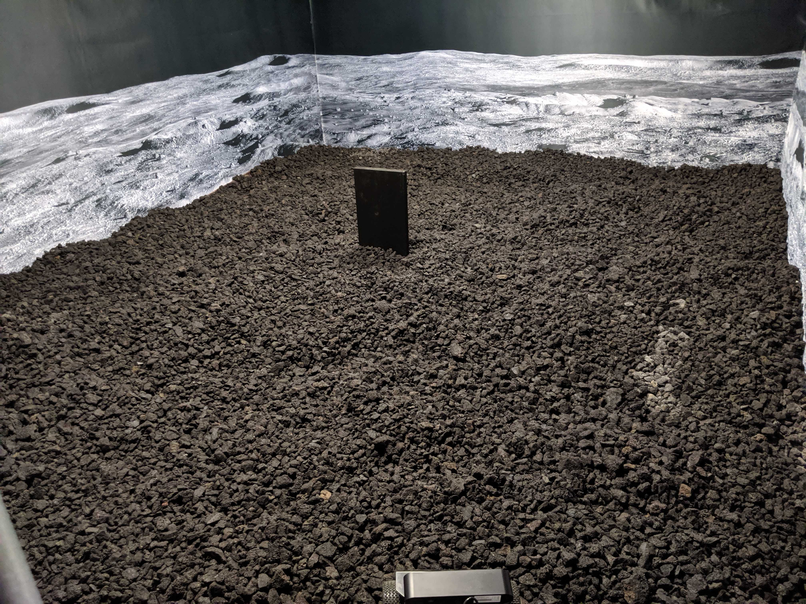

# OffWorld Gym
### Real-world robotics environment for Reinforcement Learning research

Install the library, change your `gym.make('CartPole-v0')` to `gym.make('OffWorldMonolith-v0')` and you are all set to run your RL algorithm on a **real robot**, for free!

  
Environment 1: OffWorld Monolith


### Getting access to the OffWorld Real
*(section about registration and resource manager)*

### Installation
The installation was tested on: Ubuntu 16.04.6  
Following these steps will prepare you for running both the Real and the Sim versions of the OffWorld Gym.  
You will be able to use Python 3 with this environemt.

#### Pre-requisites
Please install the following components using the corresponding installation instructions.

  * [ROS Kinetic](http://wiki.ros.org/kinetic/Installation/Ubuntu)
  
For GPU support also install
  * [CUDA 10.0 Library](https://developer.nvidia.com/cuda-10.0-download-archive)
  * [cuDNN 7.0 Library](https://developer.nvidia.com/cudnn)

#### Setup
```
git clone git@github.com:offworld-projects/offworld-gym.git
cd offworld-gym/scripts
./install.sh
```

To prepare a terminal for running OffWorld Gym use
```
source /home/ilya/offworld/Code/offworld-gym/scripts/gymshell.sh
```
in each new terminal to activate Gym Shell.
Or add it  your ~/.bashrc by running
```
echo "source /home/ilya/offworld/Code/offworld-gym/scripts/gymshell.sh" >> ~/.bashrc
```

To test Real environment:
	
	(add instructions here)

To test Sim environment open two terminals, activate Gym Shell, and run:
	
	1. roslaunch gym_offworld_monolith env_bringup.launch
	2. gzclient


### Examples
*(have one real and one simulated example)*
