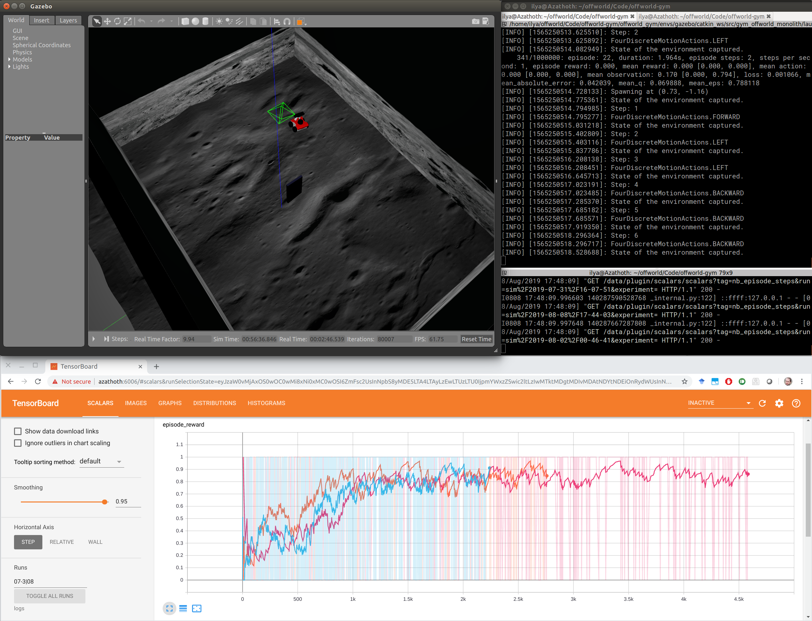

Examples
========

In our examples we use slightly `modified version <https://github.com/offworld-projects/keras-rl/tree/offworld-gym>`_ of `Keras-RL <https://github.com/keras-rl/keras-rl>`_ library that allows us to make training process resumable after an interruption (something that happens quite often when training in real) and a set of ``utils`` to visualize additional information on a TensorBoard. The ``offworld_gym`` library itself does not depend on these tools, you can ignore them, build on top of them or use for inspiration. Keras-RL was our choice, you can use any other framework when developing your RL agents.

Real
----

Sim
---

Start training by going to ``examples`` and running ``python dqn_agent_sim.py``. This will initialize the environment and start the training process, you can have a peak by running ``gzclient`` in a separate terminal.

The ``SaveDQNTrainingState`` callback will store model and memory snapshots every 100 episodes in the ``sim_agent_state`` directory. In case your process dies you can just restart the python script, confirm that you wish to resume learning from the latest snapshot, and the learning will continue. Since we are storing the DQN replay buffer alongside the model, the script saves only 3 last snapshots by default to save some storage space. Feel free to change that parameter or set it to `None` if you would like to keep all snapshots. You can also stop training manually by calling ``touch /tmp/killrlsim`` or pressing Ctrl+C (sometimes fails, better user the ``touch`` method).

Calling ``pkill -f ros`` is a good way to get rid of runaway ROS processes that might still be running if the process was not cleanly terminated.

By default the script is saving TensorBoard log data under `logs`, you can see it by running ``tensorboard --logdir=logs`` and opening `http://localhost:6006 
<http://localhost:6006>`_ in your web browser. 

    Running Sim experiments