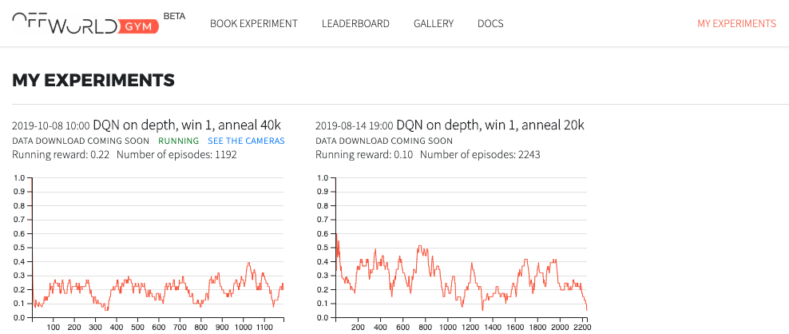
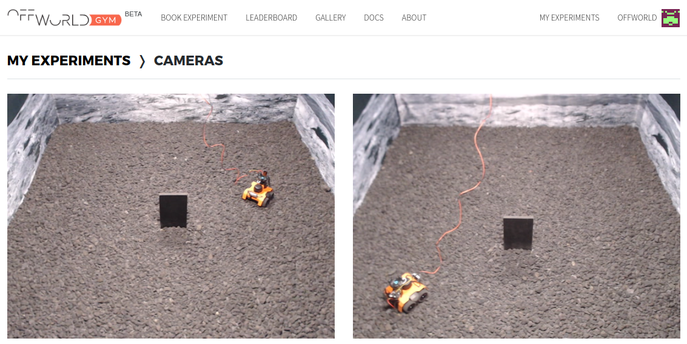

Examples
========

In our examples we use a slightly `modified version <https://github.com/offworld-projects/keras-rl/tree/offworld-gym>`_ of `Keras-RL <https://github.com/keras-rl/keras-rl>`_ library that allows us to make the training process resumable after an interruption. This is something that happens quite often when training in real. A set of ``utils`` allows you to visualize additional information on a TensorBoard. The ``offworld_gym`` library itself does not depend on these tools - you can ignore them, build on top of them or use them for inspiration. Keras-RL was our choice but you can use any other framework when developing your RL agents.

By now you have registered at `gym.offworld.ai <https://gym.offworld.ai>`_, booked you experiment time using the `resource manager <https://gym.offworld.ai/book>`_ and have copied the "OffWorld Gym Access Token" from your `Profile <https://gym.offworld.ai/account>`_ page into ``OFFWORLD_GYM_ACCESS_TOKEN`` variable in your ``offworld-gym/scripts/gymshell.sh`` script.

Minimal example in the Real environment
---------------------------------------

Execute ``source offworld-gym/scripts/gymshell.sh`` to prepare your environment and head to ``offworld-gym/examples``. Let us go over the code in ``minimal_example_OffWorldMonolithDiscreteReal.py``:

.. note::
  Make sure you have booked the time with the `resource manager <https://gym.offworld.ai/book>`_ and that you are running the experiment during your time slot.

.. code:: python

  # imports
  import gym
  import offworld_gym
  from offworld_gym.envs.common.channels import Channels
  from offworld_gym.envs.common.actions import FourDiscreteMotionActions
  from offworld_gym.envs.real.real_env import AlgorithmMode, LearningType

  # create the envronment and establish connection
  env = gym.make('OffWorldMonolithRealEnv-v0', experiment_name='Demo of a minimal example 01',
                 resume_experiment=False, channel_type=Channels.RGBD,
                 learning_type=LearningType.END_TO_END, algorithm_mode=AlgorithmMode.TRAIN)
  env.metadata = {'render.modes': []}

  # send a command to the robot
  state, reward, done, _ = env.step(FourDiscreteMotionActions.FORWARD)

  # parse the telemetry
  print("Step reward:", reward)
  print("Episode has ended:", done)

  # plot the state
  import numpy as np
  import matplotlib
  matplotlib.use('TkAgg')
  import matplotlib.pylab as plt
  fig, (ax1, ax2) = plt.subplots(1, 2);
  ax1.imshow(np.array(state[0, :, :, :3], dtype='int'));
  ax2.imshow(np.array(state[0, :, :, 3]), cmap='gray');
  plt.show();

The first code block imports all the necessary dependencies, including the core libraries and definitions of the actions and learning modes we will need in this example. The full list of available definitions is available under `offworld_gym.envs.common <source/offworld_gym.envs.common.html>`_ package API.

Next, we initialize the environment and register the experiment by calling ``gym.make()``. Here is the breakdown of the arguments:

  * ``'OffWorldMonolithRealEnv-v0'`` -- the name of the environment we want to interact with. See the full list of available environments under `Environments <source/environments.html>`_.
  * ``experiment_name='Demo of a minimal example 01'`` -- the name of the experiment you are about to run. This name is used to uniquely identify the experiment and will also appear in the `list of your experiments <https://gym.offworld.ai/myexperiments>`_ and on the `Leaderboard <https://gym.offworld.ai/leaderboard>`_.
  * ``resume_experiment=False`` -- indicates that we are registering a new experiment. Use ``True`` if you would like to continue a previously initialized experiment instead.
  * ``channel_type=Channels.RGBD`` -- we would like to receive RGB camera data and the Depth camera data. See `offworld_gym.envs.common.channels <source/offworld_gym.envs.common.html#module-offworld_gym.envs.common.channels>`_ documentation for the full list of available channels. 
  * ``learning_type=LearningType.END_TO_END`` -- which type of learning experiment you are conducting. As of now we distinguish between end-to-end, sim-to-real and human-demonstration experiments. See `offworld_gym.envs.common.enums.LearningType <source/offworld_gym.envs.common.html#offworld_gym.envs.common.enums.LearningType>`_ for more details.
  * ``algorithm_mode=AlgorithmMode.TRAIN`` -- default mode of the experiment. Use `AlgorithmMode.TEST` to evaluate your algorihtm in a test mode and rank its performance for the Leaderboard. More details at `offworld_gym.envs.common.enums.AlgorithmMode <source/offworld_gym.envs.common.html#offworld_gym.envs.common.enums.AlgorithmMode>`_.

``env.metadata = {'render.modes': []}`` disables OpenAI gym's built-in state rendering mechanism. In this example we do this for illustrative purposes.

The next call to ``env.step()`` is the most exciting part of the example. This will tell the robot to execute on of `FourDiscreteMotionActions <source/offworld_gym.envs.common.html#offworld_gym.envs.common.actions.FourDiscreteMotionActions>`_ and move the robot forward. Make sure you have your `Camera View <https://gym.offworld.ai/cameras>`_ open in a browser window in order to monitor the robot's movements!

Remaining part of the code shows how to access reward and state information and visualize it if needed.

You can follow this example by executing the commands above one by one in an interactive ``iPython`` session, or execute the whole example by running ``python3.6 minimal_example_OffWorldMonolithDiscreteReal.py``.

DQN on the real robot
---------------------

Execute ``source offworld-gym/scripts/gymshell.sh`` to prepare your environment and head to ``offworld-gym/examples``. Run ``python3.6 ddqn_OffWorldMonolithDiscreteReal.py`` to start training a DQN agent on a real robot! Note that it will only work if you have booked the time with the resource manager and the time of running the experiment is the time you've booked.

.. code:: bash

    source $OFFWORLD_GYM_ROOT/scripts/gymshell.sh
    cd $OFFWORLD_GYM_ROOT/examples
    python3.6 ddqn_OffWorldMonolithDiscreteReal.py

.. note::
   When initializing new environment you need to give a unique name for each new experiment.

   .. code:: python

      env = gym.make('OffWorldMonolithRealEnv-v0', experiment_name='My new experiment',
                     resume_experiment=False, ...)

   Alternatively you have the option to resume one of the previous experiments

   .. code:: python
   
      env = gym.make('OffWorldMonolithRealEnv-v0', experiment_name='My resumable experiment',
                     resume_experiment=True, ...)

You will now see the commands your agent is sending, the actions the robot is executing, episode progress and rewards, and other useful information. To monitor the behavior of the robot, head to `My Experiments <https://gym.offworld.ai/myexperiments>`_ section of the web page. Here you can find all the experiments you have conducted, the learning curves and other stats.

The currently active experiment will have the ``RUNNING`` indicator next to it, together with the ``SEE THE CAMERAS`` link, that gives you access to two overhead cameras positioned inside the environment:

    List of my experiments and the link to access the overhead cameras

The camera feed will be active during the entire duration of your time slot.

    Two overhead cameras to monitor robot behavior.

We wish you the best of luck with your algorithm design and hope to see you on the `Leaderboard <https://gym.offworld.ai/leaderboard>`_!

DQN in OffWorld Gym simulator
-----------------------------

Make sure you have executed ``source scripts/gymshell.sh`` before running any OffWorld Gym programs. This script takes care of setting the environment variables.

Start training by going to ``examples`` and running ``python3.6 ddqn_OffWorldMonolithDiscreteSim.py``. This will initialize the environment and start the training process; you can have a peek by running ``gzclient`` in a separate terminal.

The ``SaveDQNTrainingState`` callback will store model and memory snapshots every 100 episodes in the ``sim_agent_state`` directory. In case your process stops you can just restart the python script, confirm that you wish to resume learning from the latest snapshot, and the learning will continue. Since we are storing the DQN replay buffer alongside the model, the script saves only the 3 last snapshots by default to save some storage space. Feel free to change that parameter or set it to `None` if you would like to keep all the snapshots. You can also stop training manually by calling ``touch /tmp/killrlsim`` or pressing Ctrl+C (this sometimes fails so it is better user the ``touch`` method).

Calling ``pkill -f ros`` is a good way to clear runaway ROS processes that might still be running if the process was not cleanly terminated.

By default the script saves TensorBoard log data under `logs`, you can see the data by running ``tensorboard --logdir=logs`` and opening `http://localhost:6006 
<http://localhost:6006>`_ in your web browser. 

.. figure:: images/running-sim-experiments.png

    Running Sim experiments