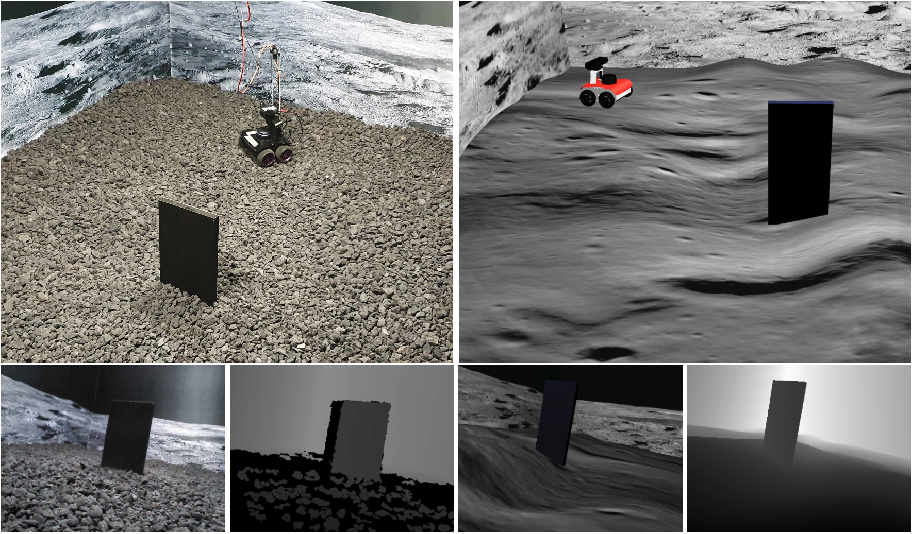

.. OffWorld Gym documentation master file, created by
   sphinx-quickstart on Thu Aug  8 19:18:03 2019.
   You can adapt this file completely to your liking, but it should at least
   contain the root `toctree` directive.

OffWorld Gym
============

The challenge that the community sets as a benchmark is usually the challenge that the community eventually solves. The ultimate challenge of reinforcement learning research is to train *real* agents to operate in the *real* environment, but until now there has not been a common real-world RL benchmark.

**OffWorld Gym is an open-access physical robotics environment for real-world reinforcement learning benchmark and research!**

Close integration into existing ecosystem allows you to start using OffWorld Gym without any prior experience in robotics and takes away the burden of managing a physical robotics system, abstracting it under a familiar API.

    Environment 1: OffWorld Monolith

Install the library, change

.. code:: python

    gym.make('CartPole-v0')

to

.. code:: python

    gym.make('OffWorldMonolithRealEnv-v0')

and you are all set to run your RL algorithm on a **real robot**, for free!

.. toctree::
    :maxdepth: 2
    :caption: Getting Started

    introduction
    getting-access
    installation
    examples

.. toctree::
    :maxdepth: 3
    :caption: Learning API

    source/environments

.. toctree::
    :maxdepth: 3
    :caption: Core API

    source/offworld_gym.envs.common
    source/offworld_gym.envs.real.core
    source/offworld_gym.envs.real.config
    source/custom-keras-callbacks

.. toctree::
    :maxdepth: 2
    :caption: Miscellaneous

    generate-documentation

Indices and tables
==================

* :ref:`genindex`
* :ref:`modindex`
* :ref:`search`

